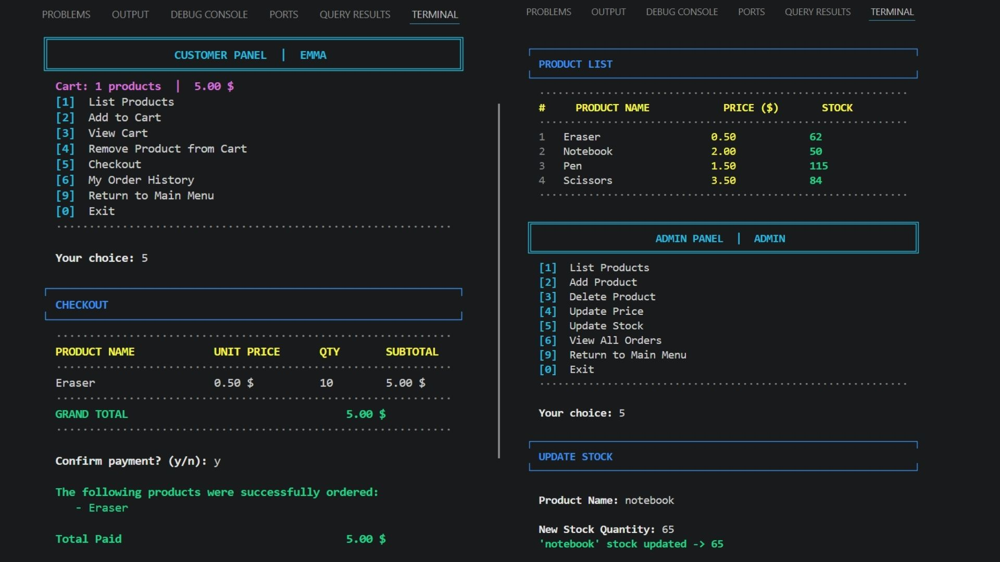

# 🛒 Order & Inventory System



A robust, console-based **Order and Stock Management System** written in Python. The application utilizes a layered architecture with object-oriented principles, featuring persistent SQLite storage and comprehensive transaction logging.

---

## 🚀 Key Features

* **Role-Based Access Control (RBAC):** Separate interactive dashboards for `Admin` and `Customer` users.
* **Case-Insensitive Authentication:** User registration and secure login validation.
* **Automated SQLite Initialization:** Pre-configured admin accounts and sample inventory populate on the first launch.
* **Inventory Management (Admin):** Live CRUD operations—list, add, delete products, and update real-time pricing/stock.
* **Dynamic Shopping Experience (Customer):** Browse products, manage cart items dynamically, and checkout securely.
* **Smart Stock Control:** Hard validation at the precise moment of payment. If stock depletes mid-session, the item drops automatically, updating the total invoice.
* **Critical Stock Alert System:** Dynamic visual indicator `! Only X left !` triggers when a product drops below threshold parameters.
* **Audit Logging:** Comprehensive operational history saved structured into a local `logs.txt` file.

---

## 🛠️ Tech Stack & Architecture

* **Language:** Python 3.x
* **Database:** SQLite 3 (Standard Library)
* **UI/UX:** Rich Console Interface utilizing ANSI Escape Codes for stylized coloring and custom geometric framing layout alignment.

---

## 📥 Installation & Running

1. **Clone the repository:**
```bash
   git clone https://github.com/fatmaSsm/Order_Inventory_System.git
   cd Order_Inventory_System
```
2. **Run the application:**
```bash
   python Order_Inventory_System.py
```

---

## 👩‍💻 Author
* **Fatma Susam** - [@fatmaSsm](https://github.com/fatmaSsm)
